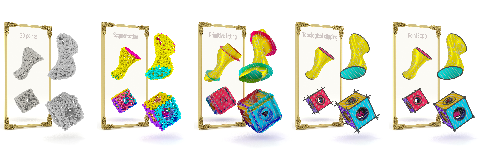

# Point2CAD: Reverse Engineering CAD Models from 3D Point Clouds

[](https://www.obukhov.ai/point2cad)
[](https://colab.research.google.com/drive/1fYxwWiX_xUyRKcCOERuF6GX4wyPA9BP2)
[](https://hub.docker.com/r/toshas/point2cad)

<p align="center">
    
</p>

This repository implements the method from our paper titled "Point2CAD: Reverse Engineering CAD Models from 3D Point Clouds" by
[Yujia Liu](https://scholar.google.com/citations?user=IwBPrmkAAAAJ&hl=en), 
[Anton Obukhov](https://www.obukhov.ai/), 
[Jan Dirk Wegner](https://www.ics.uzh.ch/en/research/research-groups/Jan-Dirk-Wegner.html), and
[Konrad Schindler](https://igp.ethz.ch/personen/person-detail.html?persid=143986).

As shown in the figure above, it takes the raw point cloud of a CAD model scan and reconstructs its surfaces, edges, and corners.

## Interactive Demo Gallery

Explore select models from the ABC CAD models dataset, showcasing their reconstruction by our method and competition, on the project page: 

[](https://www.obukhov.ai/point2cad)

## Quick Start

To reconstruct your own CAD model, use Colab or your local environment as described below. 

### Local Environment (5 min, recommended)

To process the CAD models from the assets folder, just clone the repository and run the command below in the repository root. 
The process finishes in less than 5 min on a machine with a GPU. 
Running without a GPU is also very feasible.
Inspect results in the `out` directory.

```shell
docker run -it --rm --gpus "device=$CUDA_VISIBLE_DEVICES" -v .:/work/point2cad toshas/point2cad:v1 python -m point2cad.main
```

### Google Colab (30 min)

Colab eliminates the need to run the application locally and use Docker. 
However, it may be slower due to the time taken to build the dependencies.
Unlike the dockerized environment, the Colab functionality is not guaranteed. 
Click the badge to start:

[](https://colab.research.google.com/drive/1fYxwWiX_xUyRKcCOERuF6GX4wyPA9BP2?usp=sharing)


### Run with Your Data

If you want to run the process on your own point clouds, add the `--help` option to learn how to specify inputs file path and outputs directory path.
*Only in the dockerized runtime: both paths must be under the same repository root path*. 

## Development

The code has many native dependencies, including PyMesh. To build from source and prepare a development environment, clone the repository and run the following command:

```shell
cd build && sh docker_build.sh
```

Then simply run from the repository root:

```shell
docker run -it --rm --gpus "device=$CUDA_VISIBLE_DEVICES" -v .:/work/point2cad point2cad python -m point2cad.main 
```

If docker is unavailable, refer to [PyMesh](https://github.com/PyMesh/PyMesh) installation guide to build the environment from source, or simply follow the steps from the [Dockerfile](build/Dockerfile) or [Colab installation script](build/colab_build.sh).

## About the Demo

CAD model reconstruction from a point cloud consists of two steps: point cloud annotation with surface clusters (achieved by [ParseNet](https://github.com/Hippogriff/parsenet-codebase), [HPNet](https://github.com/SimingYan/HPNet), *etc.*), and reconstructing the surfaces and topology. 

Pretrained [ParseNet](https://github.com/Hippogriff/parsenet-codebase) models can be found here: [for input points with normals](http://neghvar.cs.umass.edu/public_data/parsenet/pretrained_models/parsenet.pth) and [for input points without normals](https://drive.google.com/file/d/1BGLMR29yDvt1lstxlsPiWlkdJTmVb4Bf/view?usp=share_link). If it is not working, please use the weights in [point2cad/logs](point2cad/logs). To utilize it, please place the script [point2cad/generate_segmentation.py](point2cad/generate_segmentation.py) in the [ParseNet repository](https://github.com/Hippogriff/parsenet-codebase), and execute it in there.

This code focuses on the second part (views 3, 4, 5 from the teaser figure above) and requires the input point cloud in the `(x, y, z, s)` format, where each 3D point with `x`, `y`, `z` coordinates is annotated with the surface id `s`, such as the example in the [assets](assets) folder. 

The process stores the following artifacts in the output directory (`out` by default):

- `unclipped`: unclipped surfaces ready for pairwise intersection;
- `clipped`: reconstructed surfaces after clipping the margins;
- `topo`: topology: reconstructed edges and corners. 

## Licence
This software is released under a CC-BY-NC 4.0 license, which allows personal and research use only. 
For a commercial license, please contact the authors. You can view a license summary [here](LICENSE).

## Acknowledgements

- [ParseNet](https://github.com/Hippogriff/parsenet-codebase): "ParSeNet: A Parametric Surface Fitting Network for 3D Point Clouds", Sharma G. et. al., 2020
- [geomfitty](https://github.com/mark-boer/geomfitty): A python library for fitting 3D geometric shapes
- [Color map](dependencies/perceptual_colormap/colormap2d.png): "Revisiting Perceptually Optimized Color Mapping for High-Dimensional Data Analysis", Mittelstädt. S et. al., 2014
